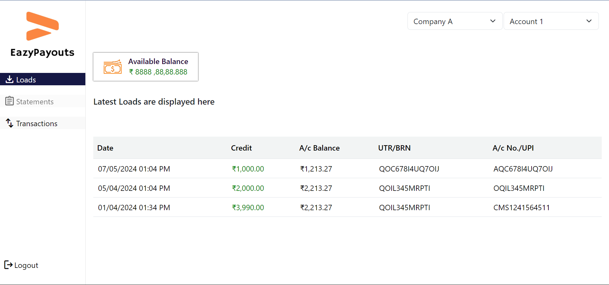

## EazyPayouts Dashboard

### Project Overview

This project is a React application for the EazyPayouts Dashboard. It provides an interface to view account balances and transactions for different companies.

## Screenshots




## Getting Started

Follow these instructions to set up and run the project locally.

### Prerequisites

- Node.js and npm installed on your machine.

### Installation

1. **Clone the repository:**

   ```sh
   git clone https://github.com/riyaj-kalegar03/Assignment-1.git
   cd Assignment 1

   ```

2. **install dependencies**

npm install

3. **To run the application, execute:**

npm run dev

**Optional: Using Faker for Fake Data**

If you want to generate fake data, you can use the faker package. Follow these step to install:

**Install the faker package:**

npm install faker

**Import and use Faker in your project:**
for fake valus

https://www.npmjs.com/package/@faker-js/faker
